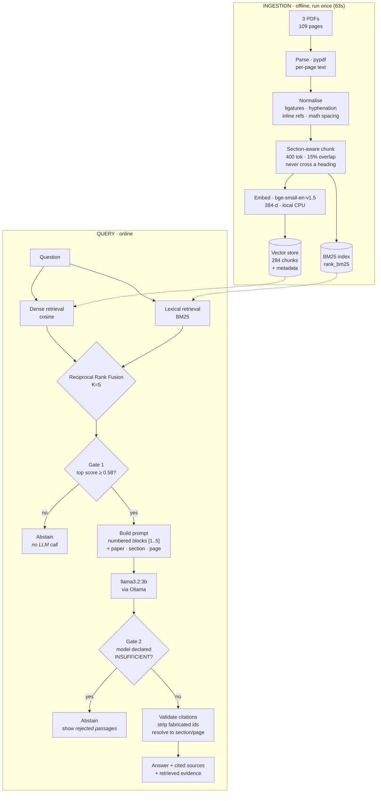

# Architecture

## System diagram



## Component decisions

| Stage | Choice | Why this, over what |
|---|---|---|
| **PDF parsing** | `pypdf` | Pure Python, no system deps, verified clean on this corpus (headings and inline math survive). *Alternatives:* PyMuPDF (faster, AGPL); `unstructured` (heavyweight, unnecessary for well-formed arXiv preprints). *Limit:* figures/tables are lost. |
| **Normalisation** | Custom, measured rules | Every rule fixes an artifact counted on this corpus, not assumed. Ligatures alone make `fine-tuning` unfindable (0 hits → 27 after NFKC). |
| **Chunking** | Section-aware, 400 tok, 15% overlap | Every benchmark answer lives inside one named section, so heading boundaries keep explanations intact. 400 because the embedding model truncates silently above 512. *Alternatives:* fixed-size (splits §3.1 mid-explanation); semantic chunking (costly, no benefit at this scale). |
| **Embeddings** | `BAAI/bge-small-en-v1.5` (384-d) | Free, offline, reproducible, seconds on CPU. *Alternatives:* MiniLM (weaker); bge-base/large (3–10× slower for gains a 284-chunk corpus can't exercise); OpenAI (paid, breaks offline reproducibility). |
| **Vector store** | Exact NumPy cosine (default) | 284 × 384 floats = 0.4 MB; a brute-force scan is **exact** and sub-millisecond. ChromaDB would pull kubernetes, grpcio, onnxruntime and opentelemetry (~30 packages) to search 284 vectors. Kept behind the same interface (`RAG_STORE=chroma`) for when the corpus outgrows memory. |
| **Retrieval** | Hybrid dense + BM25, RRF | Measured: +14.3 pp Hit@5 and +23 % MRR over dense alone, for ~1 ms. Dense handles paraphrase; BM25 handles rare exact tokens (`DPR`, `BART`, `Adam`) that dense blurs. |
| **Fusion** | RRF, K=5 | Rank-based, so it needs no normalisation between incomparable score scales. K tuned from 60 → 5 by measurement (see below). |
| **Reranking** | **Rejected** | Cross-encoder *lost* 7 pp Hit@5 and cost 100× latency. Kept selectable so the negative result is reproducible. |
| **Generation** | `llama3.2:3b` via Ollama | Fully local, no API key. Behind an `LLMProvider` Protocol, so swapping to a hosted model is config, not code. |
| **Citations** | Generate → validate → resolve | The model emits `[n]`; a validator checks each id exists, strips fabricated ones, and maps survivors to paper/section/page. |
| **Abstention** | Two independent gates | Neither alone suffices — proven on the eval set (below). |

## Why two abstention gates

Measured on the four out-of-corpus questions:

| Question | Top similarity | Caught by |
|---|---|---|
| Sourdough bread recipe | 0.452 | **Gate 1** — refused with no LLM call |
| Mixtral hyperparameters | 0.673 | Gate 2 |
| LoRA fine-tuning cost | 0.766 | Gate 2 |
| BERT SQuAD 2.0 accuracy | 0.672 | Gate 2 |

Gate 1 is a cheap similarity floor, calibrated from the observed distribution
(in-corpus 0.83–0.85, near-miss 0.61–0.77, gibberish 0.56, off-topic 0.50). It
cannot catch plausible ML questions that score high but aren't covered — all
three of those sit well above the threshold. Gate 2 catches exactly those, but
would waste an LLM call on the sourdough question. Together: 100 % abstention
accuracy, 0 hallucinations, 0 false abstentions.

## Two published defaults that measurement overturned

**RRF K = 60 → 5.** With K=60 the agreement bonus dominates absolutely: a chunk
ranked #1 by one retriever scores 1/61, while any chunk appearing in *both* at
ranks 2–3 scores 1/62 + 1/63 and always wins. That buried `2.2 Retriever: DPR`,
which BM25 ranks first. K=60 → Hit@5 85.7 %; K=5 → **92.9 %**.

**Cross-encoder reranking.** The standard "retrieve then rerank" recipe
degraded every metric here, most likely because `ms-marco-MiniLM` is trained on
short web queries against web prose rather than math-dense academic text.

## Module layout

```
rag_papers/
  config.py            env-driven settings, fail-fast validation
  schema.py            Page · Paper · Chunk · RetrievedChunk
  logging_utils.py     logging + Windows UTF-8 console fix
  pipeline.py          end-to-end orchestration + both abstention gates
  ingest/
    parse.py           PDF -> Paper
    clean.py           normalisation (ligatures, hyphenation, inline refs)
    chunk.py           section-aware chunking
    embed.py           local embeddings + exact token counting
    store.py           VectorStore protocol · NumpyStore · ChromaStore
    pipeline.py        ingestion orchestration + index manifest
  retrieve/
    dense.py           cosine retrieval
    bm25.py            lexical retrieval
    hybrid.py          Reciprocal Rank Fusion
    rerank.py          cross-encoder (measured, not recommended)
    factory.py         RAG_RETRIEVER -> strategy
  generate/
    provider.py        LLMProvider protocol · OllamaProvider
    prompt.py          grounded prompt + abstention sentinel
    citations.py       parse · validate · resolve citations
  eval/
    goldset.py         18 questions with verified gold sections
    retrieval_metrics.py   Hit@k · MRR · Recall · P@1
    answer_metrics.py      correctness · groundedness · citation quality
```

Separation is along the axis that actually changes: ingestion runs offline and
rarely; retrieval is swapped per experiment; generation is provider-specific;
evaluation must import all three without any of them importing it.
